# bdl-bscc-optimiss
Projet 2 « OPTIMISATION LIVRAISON : PLANIFICATION ORGANISATION LAST MILE »  
Données provenant de l’application OPTIMISS. Cette application permet de faire du routing (itinéraire), d'optimiser et de calculer des itinéraires de tournées facteurs.

# Liens
* **MIS** : https://wiki.net.extra.laposte.fr/confluence/display/BGDL/MIS+optimiss
* **DEX** : https://wiki.net.extra.laposte.fr/confluence/display/BGDL/DEX+optimiss

# FlowChart

```mermaid
flowchart LR
    %% Style des tables (couleurs de remplissage, texte, bordure)
    classDef topic_ws_file  fill:#000000,color:#fff,stroke:#fff
    classDef raw            fill:#eb467d,color:#fff,stroke:#fff
    classDef bronze         fill:#a16137,color:#fff,stroke:#fff
    classDef nickel         fill:#8d389c,color:#fff,stroke:#fff
    classDef silver         fill:#8f8a86,color:#fff,stroke:#fff
    classDef chrome         fill:#ebbedc,color:#000,stroke:#000
    classDef gold           fill:#f0c04f,color:#000,stroke:#000
    classDef temp           fill:#38929c,color:#fff,stroke:#fff
    classDef work           fill:#1a6e21,color:#fff,stroke:#fff
    classDef param          fill:#ececff,color:#000,stroke:#000


    %% Variables
    %% Syntaxe d'une table non-partitionnée : my_table:::raw
    %% Syntaxe d'une table     partitionnée : my_table[[my_table]]:::raw
    opm_routingRequest_in_v1:::topic_ws_file
    opm_routingResult_out_v1:::topic_ws_file


    subgraph bd_aa_xdis_raw
    r_optimiss_opm_routingrequest_in_v1:::raw
    r_optimiss_opm_routingresult_out_v1:::raw
    end

    subgraph bd_aa_xdis_safe
    b_optimiss_tournee_demande_deltas:::bronze
    b_optimiss_tournee_demande:::bronze
    b_optimiss_tournee_resultat_deltas:::bronze
    b_optimiss_tournee_resultat:::bronze
    end

    subgraph bd_aa_distri_optimized
    s_distri_tournee_optimiss:::silver
    end

    %% Flux
    %% Syntaxe d'un flux principal  : -->
    %% Syntaxe d'un flux secondaire : -..->
    opm_routingRequest_in_v1                   --> r_optimiss_opm_routingrequest_in_v1
    opm_routingResult_out_v1                   --> r_optimiss_opm_routingresult_out_v1
    r_optimiss_opm_routingrequest_in_v1        --> b_optimiss_tournee_demande_deltas
    b_optimiss_tournee_demande_deltas          -..-> b_optimiss_tournee_demande
    r_optimiss_opm_routingresult_out_v1        --> b_optimiss_tournee_resultat_deltas
    b_optimiss_tournee_resultat_deltas         -..-> b_optimiss_tournee_resultat
    b_optimiss_tournee_demande                 --> s_distri_tournee_optimiss
    b_optimiss_tournee_resultat                --> s_distri_tournee_optimiss

```

> **Légende**
> * **Trait plein** : Ce flux transporte les données principales, relatives au 'coeur de Métier' de l'application
> * **Trait pointillé** : Ce flux transporte des données secondaires, moins importantes et principalement utilisées lors jointure/union/...
> * **Doubles bordures verticales** : Cette table est partitionnée

# Historique des évolutions fonctionnelles et techniques
| Date de MEP | Version  | Jira                                                               | Description                                                |
|-------------|----------|--------------------------------------------------------------------|------------------------------------------------------------|
| 2023-08-09  | 02_00_00 |                                                                    | Première MEP                                               |

# Notes
PAG DATA et IA (2023)   

Durant les différents ateliers, les métiers ont exprimé des besoins de données. Il en résulte notamment l’identification de topics (ou autre source) à ingérer afin d’exploiter des données non encore présentes dans le datalake BDL. .  
 
/!\ Ce topic contient des Données à Caractère Personnel (DCP) : IMEINumber et mission_actorId

# TODO List
*
